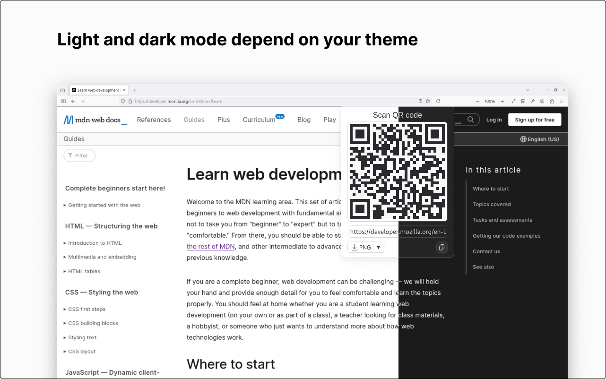

 <!-- flex method does not work-->
    
    <h1>LinkQR</h1>
	
 

[Changelog](./CHANGELOG.md)

LinkQR is a Firefox extension that simplifies the process of converting web links into QR codes with just a single click. It empowers users to effortlessly copy or download QR codes in PNG/SVG format for convenient sharing. It works completely offline and local.

    
    

## Table of Contents

- [Features](#features)
- [Install](#install)
    - [Development and Testing](#development-and-testing)
- [Usage](#usage)
	- [Browser address bar button](#browser-address-bar-button)
    - [Context Menu Options](#context-menu-options)
    - [Keyboard shortcuts](#keyboard-shortcuts)
- [Maintainers](#maintainers)
- [Contributing](#contributing)
- [Acknowledgements](#acknowledgements)
- [License](#license)

## Features

- [x] Generates QR code from current tab URL
- [x] Extension icon located at the end of the address bar
- [x] Option to download QR Code as PNG or SVG
- [x] Offline support
- [x] Automatically adapts to user's Firefox theme (light or dark)
- [x] Ability to copy QR code as PNG
- [x] Right-click context menu to generate QR code for current tab
- [x] Right-click context menu to generate QR code for links

### TODO
- [ ] Enable HTTPS for All windows, with options to disable 

## Install

 
Available on the [Firefox Add-ons site](https://addons.mozilla.org/firefox/addon/link-qr/)

### Development and Testing

To install the LinkQR Firefox extension for development and testing:
1. Clone or download the source code from the [GitHub repository](https://github.com/xKe00/LinkQR).
2. Open Firefox and navigate to `about:debugging`.
3. Click on "This Firefox" in the left sidebar.
4. Click on "Load Temporary Add-on...".
5. Navigate to the directory where you cloned or downloaded the extension's source code, and select the `manifest.json` file inside the extension's directory.
6. Once loaded, the extension should be available for testing and development.

## Usage

### Browser Address Bar Button

Click the button next to the browser's address bar to instantly reveal the QR Code for the current webpage. You'll have the option to download or copy the code with ease.

### Context Menu Options

#### Webpage Context Menu:

Right-click anywhere on a webpage to access the context menu. Look for "Open LinkQR" and click to reveal the QR Code of the current webpage.

#### Link Context Menu:

Right-click on a link to access the context menu. Choose "Generate LinkQR Code" to reveal the QR Code for the selected link.

### Keyboard Shortcuts

- Ctrl+Alt+Q: Open the LinkQR Popup for current webpage.

## Maintainers

[@xKe00](https://github.com/xKe00).

## Contributing

Feel free to dive in! [Open an issue](https://github.com/xKe00/LinkQR/issues/new) or submit PRs.

LinkQR follows the [Contributor Covenant](http://contributor-covenant.org/version/1/3/0/) Code of Conduct.

## Acknowledgements

 * [firefox-qr](https://github.com/pudymody/firefox-qr?tab=readme-ov-file#about-the-project) - Used for generating QR codes in the Firefox browser extension.

## License

[LinkQR](https://github.com/xKe00/LinkQR) Copyright &#169; 2024 [xKe00](https://github.com/xKe00).

This project is licensed under the GNU General Public License v3.0 - see [LICENSE](LICENSE) for more information.
